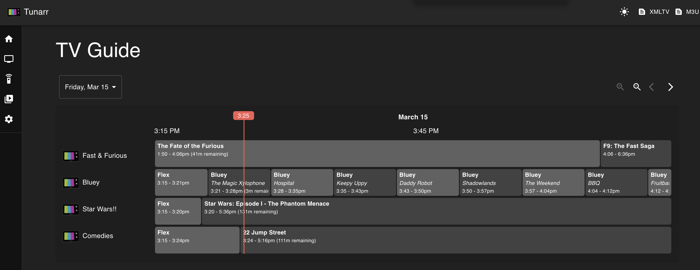
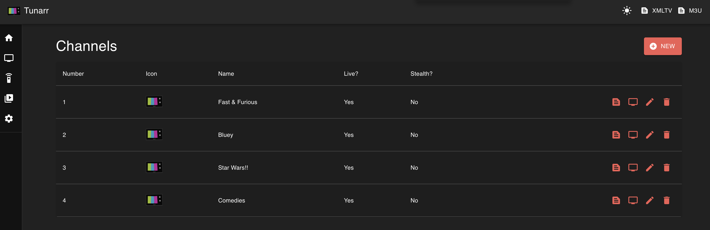

# Tunarr

[](https://github.com/chrisbenincasa/tunarr/stargazers) [](https://hub.docker.com/r/chrisbenincasa/tunarr) [](https://hub.docker.com/r/chrisbenincasa/tunarr/tags)

Create and configure live TV channels using media on your Plex, Jellyfin, or Emby servers.

Access your channels by adding the spoofed Tunarr HDHomerun tuner to Plex, Jellyfin, or Emby. Or utilize the m3u URL with any IPTV player app (we love [UHF](https://www.uhfapp.com/) and [Tivimate](https://tivimate.com/)).

<p align="center">


</p>

> [!IMPORTANT]
>
> - ⚠️ Tunarr is a work in progress and is under **very active** development.
> - ⚠️ Please report any issues you encounter or suggest any ideas you have in the [issues](https://github.com/chrisbenincasa/tunarr/issues)
>   section or in [Tunarr's discord server](https://discord.gg/svgSBYkEK5).

## What is this?

Tunarr is a rewrite + rebrand of [**dizqueTV**](https://github.com/vexorian/dizquetv) (which in itself was a fork of [other projects](https://github.com/DEFENDORe/pseudotv)!). This project was born out of both a love for TV and an appreciation for the work put into dizqueTV and its predecessors.

Tunarr has the following goals:

- Modernize the stack, both backend and frontend
- Stabilize the program, fix bugs, and improve performance (Tunarr currently is developed and tested on Node 22, [non-trivial performance improvements](https://blog.rafaelgss.dev/state-of-nodejs-performance-2023) over previous versions)
- Modernize and "prettify" the Web UI
- And of course, **Add a ton great new features!**

## Features

- **NEW** Advanced filtering of Plex libraries, helping to easily find the content you want to schedule
- **NEW** Jellyfin / Emby library support!
- **NEW** Stream your channels directly in the [browser](https://github.com/chrisbenincasa/tunarr/pull/116)
- **NEW** Complete rewrite of streaming pipeline, offering better stability and improved performance
- **NEW** New and more powerful [scheduling options](https://tunarr.com/configure/scheduling-tools/)!
- **NEW** [Dark mode!](https://github.com/chrisbenincasa/tunarr/pull/34)
- **NEW** Quickly find content you want for your channels with [advanced filtering and sorting](https://github.com/chrisbenincasa/tunarr/pull/210) (Jellyfin filtering [coming soon](https://github.com/chrisbenincasa/tunarr/issues/752))
- **NEW** Scheduled, configurable backups - never lose your channels and configuration!
- **NEW** Support multiple transcode configurations and set them per-channel
- **NEW** Audio language preference support
- **NEW** Improved UI for time/random slot scheduling
- **NEW** Improved Subtitle support: support for image and text based subtitles. Supports extracting embedded text based subtitles. Configure subtitle preferences (language, subtitle type, etc) per-channel.
- Spoofed [HDHR](https://www.silicondust.com/hdhomerun/) tuner and a IPTV channel list, providing a large amount of flexibility and easing integration with [xTeVe](https://github.com/xteve-project/xTeVe) or [Threadfin](https://github.com/Threadfin/Threadfin) and Plex, or the IPTV client of your choice.
- Customize channels with a logo, filler content ("commercials", music videos, prerolls, channel branding videos) between programming, and more!
- View channel lineups on the web-based TV Guide
- Support for hardware accelerated transcoding, including Nvidia, VAAPI, QuickSync, and macOS VideoToolbox. (AMF; #1131 and Vulkann #1172 are coming soon!)

## Limitations

- Like dizqueTV, Tunarr does not currently watch your Plex server for media updates/changes. You must manually remove and re-add your programs for any changes to take effect. Same goes for Plex server changes (changing IP, port, etc).. You&apos;ll have to update the server settings manually in that case. **NOTE** This feature is actively under development! (https://github.com/chrisbenincasa/tunarr/issues/15)

## Releases

- https://github.com/chrisbenincasa/Tunarr/releases

## Wiki

- For setup instructions, check our [documentation site](https://tunarr.com/)

## Development

At a high level, [pnpm](https://pnpm.io) is Tunarr's package manager and [turbo](https://turbo.build/) is used for task running in the repo.

### Web

[vite](https://vitejs.dev/) is used for web dev and bundling.

### Start dev servers

1. Install deps:

```
pnpm i
```

2. Start dev servers:

```
pnpm turbo dev
```

After the servers are running, the backend should be available at `localhost:8000` and the frontend at `localhost:5173/web`.

## License

- The original dizqueTV is released under zlib license (c) 2020 Victor Hugo Soliz Kuncar: we've kept this.
