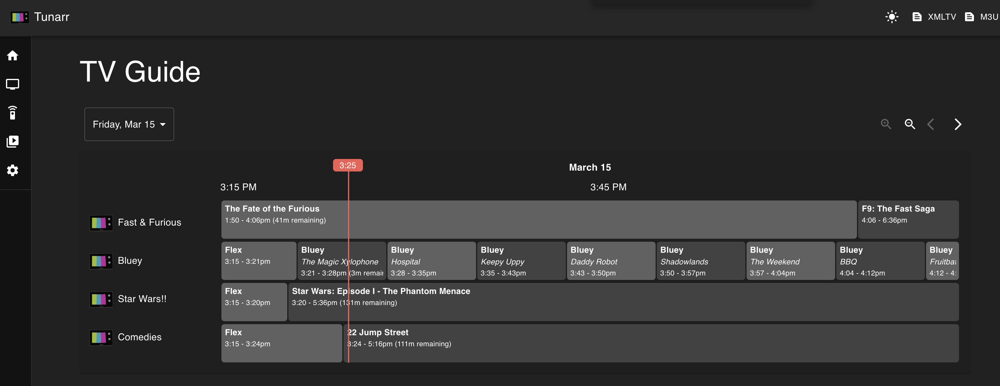
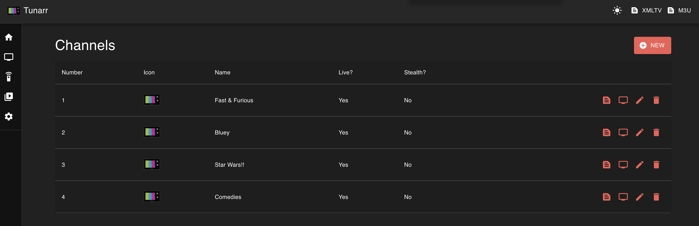
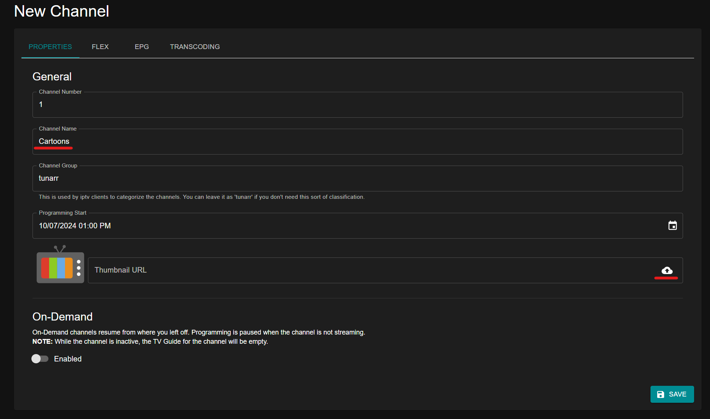

<p align="center">
  
</p>

<h1 align="center">Tunarr</h1>

<p align="center">Create your own live TV channels from media on Plex, Jellyfin, Emby, or local files.</p>

<p align="center">
  <a href="https://github.com/chrisbenincasa/tunarr/releases"></a>
  <a href="https://hub.docker.com/r/chrisbenincasa/tunarr"></a>
  <a href="https://github.com/chrisbenincasa/tunarr/stargazers"></a>
  <a href="https://discord.gg/7tUjBbDxag"></a>
  <a href="LICENSE"></a>
</p>

---

## What is Tunarr?

Tunarr lets you build custom live TV channels out of your existing media libraries — movies, TV episodes, music videos, or local files — and stream them as if they were real broadcast channels.

Tune in by adding Tunarr's spoofed HDHomeRun tuner to Plex, Jellyfin, or Emby, or grab the M3U URL for any IPTV player like [Tivimate](https://tivimate.com/) or [UHF](https://www.uhfapp.com/).

## Features

**Media Sources**

- Connect Plex, Jellyfin, Emby, or local file libraries
- Advanced search, filter, and sort across all connected libraries

**Channel Management**

- Drag-and-drop lineup editor
- Filler content between programs (commercials, music videos, prerolls, branding)
- Per-channel logos and automatic configuration backups

**Scheduling**

- Time-slot and random-slot scheduling tools
- Web-based TV guide for viewing channel lineups

**Playback & Integration**

- Spoofed [HDHR](https://www.silicondust.com/hdhomerun/) tuner for Plex, Jellyfin, and Emby
- M3U/IPTV output for [Dispatcharr](https://github.com/Dispatcharr/Dispatcharr), [Threadfin](https://github.com/Threadfin/Threadfin), [xTeVe](https://github.com/xteve-project/xTeVe), or any IPTV client
- Stream channels directly in the browser
- Per-channel audio language and subtitle preferences

**Transcoding**

- Hardware-accelerated transcoding: Nvidia NVENC, VAAPI, Intel QuickSync, macOS VideoToolbox
- Multiple transcode profiles, configurable per channel

## Screenshots

<table>
  <tr>
    <td align="center"><br><em>Channel Management</em></td>
    <td align="center"><br><em>Channel Configuration</em></td>
  </tr>
</table>

## Quick Start

The easiest way to run Tunarr is with Docker Compose. Create a `docker-compose.yml`:

```yaml
services:
  tunarr:
    image: chrisbenincasa/tunarr:latest
    container_name: tunarr
    ports:
      - 8000:8000
    environment:
      - TZ=America/New_York
    volumes:
      - ./tunarr-data:/config/tunarr
    restart: unless-stopped
```

Then run:

```bash
docker compose up -d
```

Tunarr will be available at `http://localhost:8000`.

**Other installation options:**

| Platform                 | Method                                                                   |
| ------------------------ | ------------------------------------------------------------------------ |
| Linux / macOS / Windows  | [Standalone binaries](https://github.com/chrisbenincasa/tunarr/releases) |
| Unraid                   | Community App Store                                                      |
| Proxmox                  | [LXC helper script](https://tunarr.com/install/proxmox)                  |
| ARM (Raspberry Pi, etc.) | Docker image (`linux/arm64`)                                             |

For hardware-accelerated transcoding setup, see the [transcoding docs](https://tunarr.com/configure/transcode/).

## Documentation

- [Installation guide](https://tunarr.com/install/)
- [Creating channels](https://tunarr.com/configure/channels/)
- [Scheduling tools](https://tunarr.com/configure/scheduling-tools/)
- [Transcoding configuration](https://tunarr.com/configure/transcode/)
- [Full documentation](https://tunarr.com/)

## Development

```bash
pnpm i
pnpm turbo dev  # backend at :8000, frontend at :5173/web
```

See [CONTRIBUTING.md](CONTRIBUTING.md) for a full development guide.

## Community

- [Discord](https://discord.gg/7tUjBbDxag) — chat, help, and announcements
- [GitHub Issues](https://github.com/chrisbenincasa/tunarr/issues) — bug reports and feature requests
- [GitHub Discussions](https://github.com/chrisbenincasa/tunarr/discussions) — questions and general conversation

## License

Tunarr is released under the [Zlib License](LICENSE).
