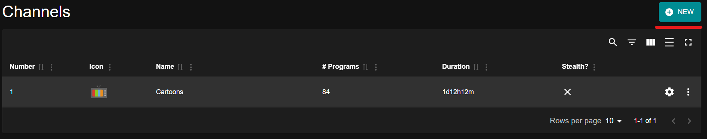

# Channels

Channels are the core of Tunarr. Each channel acts like a virtual TV station with its own programming schedule, stream settings, and EPG data.

Click the **NEW** button to create your first channel, which will take you to the [Channel Properties](properties.md) page.

-   **[Properties](properties.md)**

    ---

    Configure basic channel settings like name, number, icon, and group.

-   **[Programming](programming.md)**

    ---

    Add shows, movies, and other content to your channel's schedule.

-   **[Flex](flex.md)**

    ---

    Configure filler content to play during gaps in your schedule.

-   **[EPG](epg.md)**

    ---

    Customize how your channel appears in electronic program guides.

-   **[Transcoding](transcoding.md)**

    ---

    Configure stream modes and transcoding settings per channel.

-   **[Watermarks](watermarks.md)**

    ---

    Add logo overlays and watermarks to your channel's video output.

## Getting Started

1. Create a new channel with [Properties](properties.md)
2. Add content via [Programming](programming.md)
3. Use [Scheduling Tools](../scheduling/index.md) to organize your lineup
4. Configure a [Client](../clients/index.md) to watch your channel
