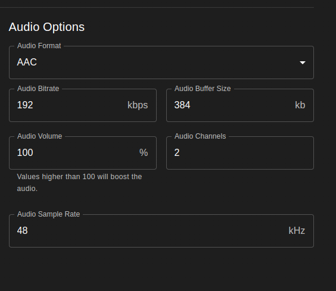

# Transcode Configs

Transcode Configurations provide Tunarr with a set of parameters to produce a normalized output stream for a given channel. These configurations are responsible for options like hardware acceleration, output video/audio formats, bit rates, and more. Transcode configurations are applied per-channel. This page explores some of these options at a high level.

## Video

Configure output video parameters, such as format, hardware acceleration, and resolution.

<figure markdown="span">
    
    <figcaption>Video Options as of 0.22.11</figcaption>
</figure>

## Audio

Configure output audio parameters, such as format, channels, and sample rate.

<figure markdown="span">
    
    <figcaption>Audio Options as of 0.22.11</figcaption>
</figure>

Notes about audio settings:

1. "Audio Channels" uses whole number channel counts. For instance, a 5.1 configuration would be configured as "6".
2. "Audio Format" can be set to "copy" to passthrough audio

## Errors

Configure how Tunarr reacts to transcoding errors. Tunarr can be configured to output an error image on the screen, with or without audio.

!!! info
    More configurable error options are tracked in [chrisbenincasa/tunarr#1292](https://github.com/chrisbenincasa/tunarr/issues/1292)

<figure markdown="span">
    
    <figcaption>Error Options as of 0.22.11</figcaption>
</figure>