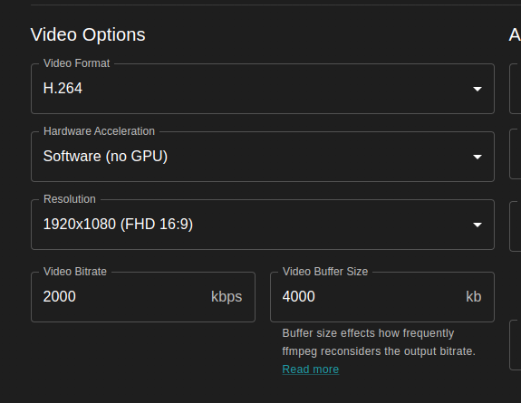
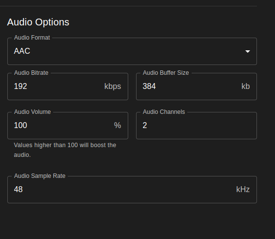
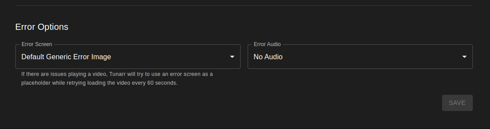

# Transcode Configs

Transcode Configurations provide Tunarr with a set of parameters to produce a normalized output stream for a given channel. These configurations are responsible for options like hardware acceleration, output video/audio formats, bit rates, and more. Transcode configurations are applied per-channel and can be shared across multiple channels. This page explores each option in detail.

!!! warning "Performance: Hardware Acceleration Strongly Recommended"
    Software transcoding (Hardware Acceleration = **None**) is **extremely CPU-intensive**. Transcoding even a single 1080p stream can saturate multiple CPU cores, and on modest or low-power hardware (NAS devices, Raspberry Pi, older PCs) it will cause dropped frames, stuttering, or an inability to keep up with real-time playback.

    **Hardware-accelerated encoding is strongly recommended for most users.** See [Hardware Acceleration](#hardware-acceleration) below to find the right mode for your system.

---

## General Settings

- **Name** — A human-readable label for this configuration. Used to identify the config when assigning it to a channel.
- **Thread Count** — The number of CPU threads FFmpeg may use for software encoding and decoding. Set to `0` to let FFmpeg choose automatically based on the number of logical CPU cores. Higher values use more CPU resources. This setting is largely irrelevant when hardware acceleration is enabled, since encoding and decoding are offloaded to dedicated hardware.
- **Disable Channel Overlay** — When enabled, suppresses the channel watermark/logo overlay for streams using this configuration. Useful if you want a clean output without branding.

---

## Video

Configure output video parameters including hardware acceleration, format, resolution, and bitrate.

<figure markdown="span">
    
    <figcaption>Video Options as of 0.22.11</figcaption>
</figure>

### Hardware Acceleration

Hardware acceleration offloads video encoding and decoding from the CPU to dedicated hardware (GPU or media engine), dramatically reducing CPU usage and allowing real-time transcoding on modest hardware.

| Mode | Platform | Tonemapping | When to Use |
|------|----------|-------------|-------------|
| **None** | Any | Software | Software-only transcoding. CPU-intensive. Only use if no hardware acceleration is available or for debugging. |
| **CUDA** | NVIDIA GPUs (Linux/Windows) | Hardware (Vulkan) / Software fallback | Requires an NVIDIA GPU with NVENC support. The most reliable hardware path on Linux and Windows with NVIDIA hardware. |
| **VAAPI** | Intel / AMD GPUs (Linux) | `tonemap_vaapi` / `tonemap_opencl` / Software fallback | Uses the Video Acceleration API. Defaults to `/dev/dri/renderD128`. Supported drivers: `system`, `ihd`, `i965`, `radeonsi`, `nouveau`. **Recommended for Intel and AMD users on Linux.** |
| **QSV** | Intel GPUs (Linux/Windows) | Hardware (experimental) | Intel Quick Sync Video. Cannot hardware-decode 10-bit H.264 or HEVC content. Generally less stable than VAAPI on Linux; may work well on Windows. |
| **VideoToolbox** | macOS | Not supported | Apple's hardware video codec framework. Works on both Apple Silicon and Intel Macs. Recommended for all macOS users. |

!!! info "Linux with Intel GPU: VAAPI vs QSV"
    If you are running Tunarr on Linux with an Intel GPU, **VAAPI is the recommended choice** over QSV. VAAPI is generally more stable, better tested with Tunarr. QSV may work for some users but can produce compatibility issues with certain codecs and bit depths.

When **VAAPI** or **QSV** is selected, additional options appear:

- **VAAPI Driver** — Select the driver your system uses (`system`, `ihd`, `i965`, `radeonsi`, `nouveau`). Leave as `system` unless you know you need a specific driver.
- **VAAPI Device Path** — Path to the DRI render device (default: `/dev/dri/renderD128`). Change this only if your device is at a non-standard path (e.g., `/dev/dri/renderD129` when multiple GPUs are present).

When **VAAPI** is selected, Tunarr will automatically use hardware-accelerated pad filters (`pad_vaapi`, or `pad_opencl` as a fallback) for letterboxing and pillarboxing operations. This keeps padding on the GPU and avoids a round-trip to software. If your hardware does not support these filters or you observe artifacts, you can force software padding by setting `TUNARR_DISABLE_VAAPI_PAD=true`.

### Video Format

Controls the codec used to encode the output video stream.

- **H.264 (AVC)** — The most compatible format, supported by virtually all clients and devices. A safe default for most setups.
- **HEVC (H.265)** — Better compression than H.264 at equivalent quality, meaning lower bitrates for the same visual quality. However, encoding is more computationally expensive, and not all clients support HEVC playback. Recommended only if your clients support it and you have capable hardware.
- **MPEG-2** — A legacy format with the highest compatibility but the least efficient compression. Only use this if you have specific clients that require it.

### Resolution

Sets the output resolution as width × height. Tunarr will scale the source video to this resolution. Available presets range from 420×420 to 3840×2160 (4K UHD), with 1920×1080 (Full HD) as a reasonable default for most setups.

!!! warning
    Higher resolutions significantly increase the load on both the encoder and any connected hardware. Transcoding 4K content in software is not feasible on most hardware. Even with hardware acceleration, ensure your GPU supports encoding at the target resolution before selecting 4K.

### Video Bitrate

The target output bitrate for the video stream, in kilobits per second (kbps). FFmpeg uses this as a target and may produce slightly higher or lower bitrates depending on scene complexity.

- **Default: 2000 kbps** — Suitable for 720p content
- For 1080p, 4000–8000 kbps is a common range
- For 4K, 15000–25000 kbps is typical

Lower bitrates reduce file size and network usage but decrease visual quality. Higher bitrates improve quality at the cost of bandwidth and storage.

### Video Buffer Size

Controls how frequently FFmpeg re-evaluates the output bitrate, in kilobits. A larger buffer allows more bitrate variation over a short period; a smaller buffer enforces stricter bitrate compliance.

A common starting point is roughly **2× the video bitrate** (e.g., 4000 kb buffer for a 2000 kbps target). Increase the buffer if you notice bitrate spikes causing buffering; decrease it for more consistent network usage.

### Normalize Frame Rate

When enabled, forces the output stream to a consistent frame rate (e.g., 23.976, 29.97, or 60 fps). This is recommended for most setups, as mixing frame rates across lineup items can cause playback issues or stuttering with some clients.

### Deinterlace Video

Applies a deinterlace filter to the output. Enable this if your source content is interlaced — common with recordings from broadcast or cable TV. The specific deinterlace filter used is configured globally in FFmpeg settings. This setting has no effect on progressive (non-interlaced) source content.

### HDR Tonemapping

!!! warning "Experimental"
    HDR tonemapping is an experimental feature. Results may vary depending on hardware, driver version, and source content. It may cause stream errors on some configurations. Monitor logs closely when first enabling it.

When Tunarr encounters HDR content (HDR10 or HLG), it can convert it to SDR during transcoding. This is useful when playback devices or clients do not support HDR, or when a consistent SDR output is required regardless of source content.

Tonemapping is **disabled by default**. To enable it, set the `TUNARR_TONEMAP_ENABLED` environment variable (see [Environment Variables](../../getting-started/run.md#transcoding)).

When enabled, Tunarr automatically selects the best available tonemapping method for the configured hardware acceleration mode:

| Hardware Mode | Method | Notes |
|---|---|---|
| **VAAPI** | `tonemap_vaapi` → `tonemap_opencl` → software | Falls back through the chain based on what filters are supported by your hardware and FFmpeg build. |
| **CUDA** | Hardware tonemapping via Vulkan | Requires Vulkan support on the host. If Vulkan is unavailable or causing stream errors, set `TUNARR_DISABLE_VULKAN=true` to fall back to software tonemapping. |
| **QSV** | Hardware tonemapping | Experimental. May not work reliably on all hardware. |
| **None (Software)** | Software tonemapping | Used as the final fallback for all modes. More CPU-intensive than hardware paths. |

Tonemapping is only applied to content Tunarr identifies as HDR (HDR10 or HLG). SDR content is unaffected.

!!! info "Color Metadata"
    Tonemapping relies on color metadata (color space, color transfer, color primaries) stored in Tunarr's database for each program. This metadata is populated automatically when media is scanned or imported from a media source. If tonemapping is not being applied to content you expect to be HDR, try re-scanning the relevant library to ensure the metadata has been recorded.

---

## Audio

Configure output audio parameters including codec, channels, bitrate, and volume.

<figure markdown="span">
    
    <figcaption>Audio Options as of 0.22.11</figcaption>
</figure>

### Audio Format

Controls the codec used to encode the output audio stream.

- **AAC** — The default and most compatible format. Widely supported by all clients and streaming devices. Recommended for most setups.
- **AC3 (Dolby Digital)** — Good choice for surround sound (5.1) content. Supported by most TVs and AV receivers, but not all streaming clients.
- **MP3** — Widely compatible but lower quality than AAC at equivalent bitrates. Only use if a specific client requires it.
- **Copy** — Passes the audio stream through unchanged without re-encoding. When Copy is selected, all other audio settings (bitrate, sample rate, volume, channels) are **ignored**, since the stream is not being processed by FFmpeg.

### Audio Channels

The number of output audio channels as a whole integer. Common values:

- `2` — Stereo
- `6` — 5.1 surround
- `8` — 7.1 surround

### Audio Bitrate

The target output bitrate for the audio stream, in kilobits per second (kbps). For AAC stereo, 128–192 kbps is a common range. For AC3 5.1 surround, 384–640 kbps is typical.

### Audio Buffer Size

Controls how frequently FFmpeg re-evaluates the audio bitrate, in kilobits. Analogous to the video buffer size setting. A value of roughly 2× the audio bitrate is a reasonable starting point.

### Audio Sample Rate

The output sample rate in Hz. The default of **48000 Hz** (48 kHz) is standard for video content and recommended for most setups. Changing this is rarely necessary.

### Audio Volume %

Adjusts the output volume relative to the source.

- `100` — Original volume (no change)
- Values **above 100** amplify the audio (e.g., `150` = 50% louder)
- Values **below 100** attenuate the audio (e.g., `80` = 20% quieter)

!!! info
    This setting has no effect when **Audio Format** is set to **Copy**, since the audio stream is passed through without processing.

### Loudness Normalization

Tunarr supports [EBU R128](https://en.wikipedia.org/wiki/EBU_R_128) loudness normalization via FFmpeg's `loudnorm` filter. This provides more perceptually consistent loudness leveling across different programs, compared to the simple volume percentage adjustment above.

When enabled, the following parameters can be configured:

| Parameter | Range | Default | Description |
|---|---|---|---|
| **Integrated Loudness (I)** | -70.0 to -5.0 LUFS | -24.0 | Target integrated loudness. EBU R128 broadcast standard is -23 LUFS; -24 is a common streaming target. |
| **Loudness Range (LRA)** | 1.0 to 50.0 LU | 7.0 | Target loudness range (dynamic range). Lower values compress dynamics more aggressively. |
| **Max True Peak (TP)** | -9.0 to 0.0 dBTP | -2.0 | Maximum allowed true peak level, preventing clipping. |

Loudness normalization and **Audio Volume %** can be used independently of each other.

!!! info
    Loudness normalization has no effect when **Audio Format** is set to **Copy**, since the audio stream is passed through without processing.

---

## Advanced Options

!!! warning
    Do not change these settings unless you understand their implications. These are diagnostic and compatibility options intended for troubleshooting, not normal operation.

- **Disable Hardware Decoding** — Forces FFmpeg to use software (CPU) decoding even when a hardware acceleration mode is selected. Hardware encoding will still be used if enabled. This is useful when the hardware decoder is incompatible with a specific source format or bit depth (e.g., 10-bit H.264 with QSV).

- **Disable Hardware Encoding** — Forces FFmpeg to use software (CPU) encoding even when a hardware acceleration mode is selected. Hardware decoding will still be used if enabled. This can be used to debug quality issues or when the hardware encoder produces artifacts on specific content.

- **Disable Hardware Filters** — Forces CPU-based filters (scaling, deinterlacing, overlays) even when hardware acceleration is enabled. Normally, filters are applied on the GPU for efficiency. Enable this if hardware filter compatibility causes issues with your setup.

---

## Errors

Configure how Tunarr responds when a transcoding error occurs — for example, when a source file is missing or a media server is unreachable.

!!! info
    More configurable error options are tracked in [chrisbenincasa/tunarr#1292](https://github.com/chrisbenincasa/tunarr/issues/1292)

<figure markdown="span">
    
    <figcaption>Error Options as of 0.22.11</figcaption>
</figure>

### Error Video Mode

Controls what appears on screen when a transcoding error occurs:

- **pic** — Displays a placeholder image (default). A static error image is shown for the duration of the errored item.
- **blank** — Outputs a blank (black) screen with no video content.
- **static** — Outputs TV-style static/noise.
- **testsrc** — Outputs color bars with a timer, similar to a test pattern broadcast.
- **text** — Displays a text message. Requires the FFmpeg `drawtext` filter to be available.
- **kill** — Stops the stream entirely when an error occurs. The session will terminate rather than playing an error placeholder.

### Error Audio Mode

Controls what audio plays during a transcoding error:

- **whitenoise** — Plays white noise audio.
- **sine** — Plays a repeating sine wave tone (beep).
- **silent** — No audio during error periods.

!!! info "Automatic Retry"
    Tunarr automatically retries loading the errored video item every **60 seconds**. If the issue resolves (e.g., the media server comes back online), playback will resume on the next retry.
