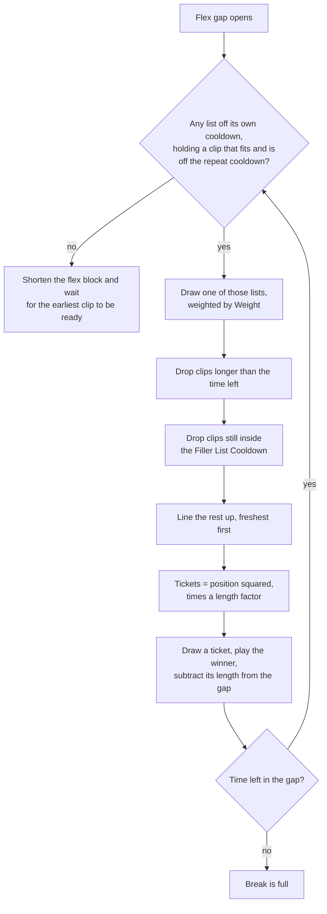

# How Filler Is Chosen

When a channel reaches [Flex](/configure/channels/flex) time, Tunarr fills the gap one clip at a time. It picks a filler list, then picks a clip from that list, plays it, and repeats until the gap is full or nothing else fits.

## The four dials

| Dial | Where to find it | What it controls |
|---|---|---|
| **Weight** | Channel → Flex → each filler list | Relative chance of drawing from that list. A list at 75 is picked three times as often as one at 25. |
| **Cooldown (s)** | Channel → Flex → each filler list | How long that whole list sits out after anything from it plays. |
| **Filler List Cooldown (seconds)** | Channel → Flex → Filler Options | How long before the *same clip* can play again. The name says list, but it applies per clip. |
| **Clip length** | The media itself | Adds weight to a clip on every draw, and decides which gaps the clip can fit into at all. |

Nothing else feeds the decision. When filler is not behaving the way you want, one of these four is the reason.

## How the pick works

Think of each draw as a raffle. Tunarr decides who is allowed to enter, hands out tickets, and pulls one.

### 1. Rule out the lists that cannot play

A list is out if it played something recently enough to still be inside its own **Cooldown (s)**. A list is also out if none of its clips can play right now, either because every clip is too long for the time left or because every clip is still inside the repeat cooldown.

### 2. Pick one of the remaining lists

Each surviving list gets tickets equal to its **Weight**. Tunarr pulls one. A list with weight 75 wins three times as often as a list with weight 25, however many clips each one holds.

### 3. Rule out the clips that cannot play

Inside the winning list, a clip is out if it runs longer than the time left in the gap. A clip is also out if it played more recently than the **Filler List Cooldown** allows.

### 4. Hand out tickets by how long each clip has waited

Tunarr lines the survivors up freshest first and numbers them. The clip that played most recently is number 1, the next is number 2, and so on up to the clip that has waited longest. A clip that has never played goes to the back of the line, which is the best place to be.

Tickets go up with the square of that number. Number 2 gets four times the tickets of number 1, number 5 gets twenty-five times, number 10 gets a hundred times. The payoff for waiting climbs steeply, and that steepness is what keeps the rotation moving.

Clip length then multiplies the ticket count, so a longer clip edges out a shorter one that has waited exactly as long.

### 5. Pull a ticket and play the winner

Tunarr subtracts the winning clip's length from the gap, then starts again at step 1 with whatever time is left.

### A worked example

Ten thirty-second clips, all eligible, none on cooldown. A thirty-second clip is worth 7 length points, so the tickets come out like this.

The same ten positions, with a 60-second clip shown alongside for comparison. Length lifts the whole curve by about 1.7x without changing its shape, so a long clip still has to wait its turn.

| Position in line | Tickets | Chance of winning |
|---|---|---|
| 1 (played most recently) | 7 | 0.3% |
| 5 | 175 | 6.5% |
| 9 | 567 | 21% |
| 10 (waited longest) | 700 | 26% |

The clip that has waited longest is a hundred times more likely to play than the one that just came off cooldown. Nothing is guaranteed, though, so an occasional near-repeat is normal.

## Cooldowns are absolute

A clip never plays inside its cooldown. If every clip in every list is still cooling down, Tunarr shortens the flex block and tries again once the earliest one is ready, rather than repeating something early.

Two consequences follow from that:

- Set the repeat cooldown longer than the gap between your breaks and you will see dead air or the channel fallback, because nothing is eligible when the break arrives.
- A clip you just added has never played, so no cooldown applies to it. Newly added filler is favoured until it has been seen once.

## Why short clips appear more often

This surprises people, and it is not a bug. A three minute break holds six thirty-second spots but only one three-minute spot. Short clips are eligible for more of the gaps, so they get more slots to win. Clip length is factored into the weighting to push back against this, but it cannot cancel it entirely.

If you want long and short clips to appear about equally often, keep the lengths within a narrow range of each other.

## If you keep seeing the same few clips

Work through these in order.

1. **Check how many clips actually fit your breaks.** A clip longer than the gap is never eligible. If your breaks are 60 seconds and most of your clips run 90, only the short ones ever play. This is the most common cause by a wide margin.
2. **Check the repeat cooldown.** A very short cooldown lets a clip come back almost immediately. Setting it to roughly the length of one break is a reasonable starting point.
3. **Check your list weights.** One list with a much higher weight than the others will dominate, no matter how many clips the other lists hold.
4. **Check the per-list cooldowns.** A long cooldown on one list takes it out of the running for that period, concentrating plays on whatever is left.
