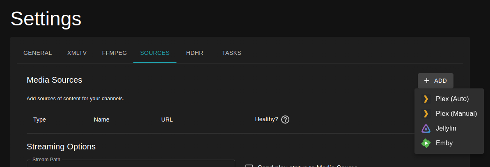
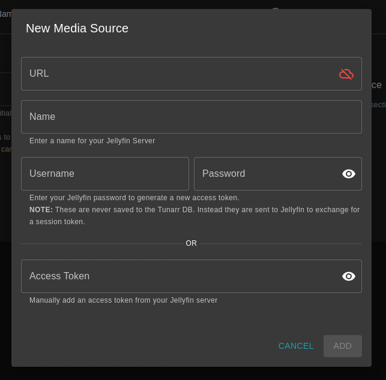

# Jellyfin

Tunarr can source content from Jellyfin servers. All metadata is provided from the Jellyfin server.

## Connect

Connect Tunarr to Jellyfin servers by navigating to Settings > Sources. There are two methods of authentication that can be used to connect a Jellyfin server.

<figure markdown="span">
    
</figure>

After clicking "Jellyfin" you will be presented with a dialog to configure the connection.

<figure markdown="span">
    
</figure>

### API Key

The simplest way to connect Jellyfin is to generate an API Key in the Jellyfin admin dashboard specifically for Tunarr. Navigate to the Jellyfin Admin Dashboard > API Keys and then click "New API Key"

<figure markdown="span">
    
</figure>

Once you've generated a new API Key, you can copy + paste the key into the "Add Jellyfin Media Source" dialog launched from the Settings > Sources page in Tunarr.

### Username / Password

!!! info
    Tunarr does **NOT** persist your Jellyfin password anywhere. However, it does issue a request to the Jellyfin API to exchange the username / password combination for an API Key, which is then persisted to the Tunarr DB.

If you cannot (i.e. you are not an Admin), or would not like to, use an API Key, you can use your username and password to connect to Jellyfin. 

## Synchronization

!!! info
    This is an alpha-only feature that will be available in v1.0

Tunarr will periodically synchronize chosen Jellyfin libraries. Synchronizing is a one-way import of Jellyfin metadata into Tunarr. Tunarr **never** mutates Jellyfin data. Importing metadata from Jellyfin allows for a richer search and scheduling experience.

After connecting your Jellyfin server, find the server in the Media Sources table and click the "Edit Libraries" button:

<figure markdown="span">
    
</figure>

You will be presented with the Jellyfin libraries that Tunarr is able to sync:

<figure markdown="span">
    
</figure>

Upon selecting libraries, they will be queued for synchronization. Tunarr will only sync one library per-source at a time. By default, Media Source libraries are all synchronized once every 6 hours. This period can be configured on the Media Source settings page.

## Stream from Disk

When using external Media Sources, it is recommended to ensure Tunarr has access to the underlying media files, which can greatly improve streaming performance and stability while reducing network activity. There are 2 ways to achieve this:

1. Ensure that Tunarr has access to the media file paths as seen by Jellyfin. Depending on your deployment, this could mean creating the same bind mounts to a Docker container or ensuring that Tunarr has access to the same shares, etc. that Jellyfin does.
2. Configure "path replacements" for the Jellyfin server to "transform" Tunarr-visible paths to ones reported by Jellyfin.

Option 1 is simpler and requires no additional configuration within Tunarr. 

### Configuring Path Replacements (stable)

On current stable versions path replacements can only be configured once for all servers, globally.

First change the "Stream Path" mode to "Direct"

<figure markdown="span">
    
    <figcaption>Direct stream path mode</figcaption>
</figure>

Then, configure your stream path. Tunarr uses prefix-matching for the "original" path to replace.

<figure markdown="span">
    
</figure>

### Configuring Path Replacements (alpha)

!!! info
    Alpha versions allow configuring path replacements per-media-source.

To configure path replacements (Option 2), click on the "Edit" button on the Media Source row. From here, you can add one or more path replace patterns to potentially apply to incoming media.

<figure markdown="span">
    
</figure>
