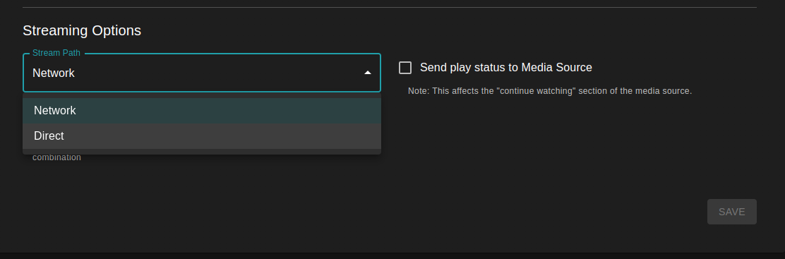
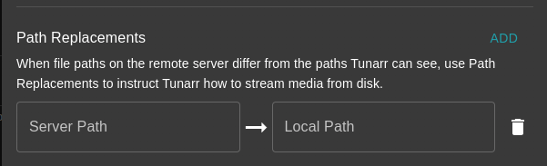

# Plex

Tunarr can source content from Plex servers. All metadata is provided from the Plex server.

## Connect

Connect Tunarr to Plex servers by navigating to Settings > Sources.

### Auto

Automatic connection launches a Plex sign in pop-up. After successful sign-in, Tunarr will use Plex APIs to discover all available Plex servers for your Plex user and subsequently add reachable ones to Tunarr.

### Manual

If you do not want to, or can't, use automatic server discovery, Plex server details can be manually added to Tunarr. You will need to obtain a Plex token by following [these instructions](https://support.plex.tv/articles/204059436-finding-an-authentication-token-x-plex-token/).

## Synchronization

!!! info
    This is an alpha-only feature that will be available in v1.0

Tunarr will periodically synchronize chosen Plex libraries. Synchronizing is a one-way import of Plex metadata into Tunarr. Tunarr **never** mutates Plex data. Importing metadata from Plex allows for a richer search and scheduling experience.

After connecting your Plex server, find the server in the Media Sources table and click the "Edit Libraries" button:

<figure markdown="span">
    
</figure>

You will be presented with the Plex libraries that Tunarr is able to sync:

<figure markdown="span">
    
</figure>

Upon selecting libraries, they will be queued for synchronization. Tunarr will only sync one library per-source at a time. By default, Media Source libraries are all synchronized once every 6 hours. This period can be configured on the Media Source settings page.

## Stream from Disk

When using external Media Sources, it is recommended to ensure Tunarr has access to the underlying media files, which can greatly improve streaming performance and stability while reducing network activity. There are 2 ways to achieve this:

1. Ensure that Tunarr has access to the media file paths as seen by Plex. Depending on your deployment, this could mean creating the same bind mounts to a Docker container or ensuring that Tunarr has access to the same shares, etc. that Plex does.
2. Configure "path replacements" for the Plex server to "transform" Tunarr-visible paths to ones reported by Plex.

Option 1 is simpler and requires no additional configuration within Tunarr. 

### Configuring Path Replacements (stable)

On current stable versions path replacements can only be configured once for all servers, globally.

First change the "Stream Path" mode to "Direct"

<figure markdown="span">
    
    <figcaption>Direct stream path mode</figcaption>
</figure>

Then, configure your stream path. Tunarr uses prefix-matching for the "original" path to replace.

<figure markdown="span">
    
</figure>

### Configuring Path Replacements (alpha)

!!! info
    Alpha versions allow configuring path replacements per-media-source.

To configure path replacements (Option 2), click on the "Edit" button on the Media Source row. From here, you can add one or more path replace patterns to potentially apply to incoming media.

<figure markdown="span">
    
</figure>