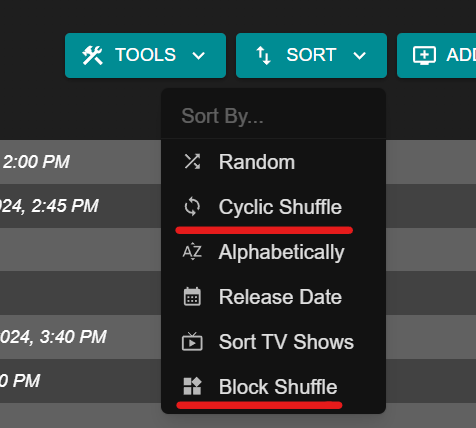

# Cyclic Shuffle

Cyclic Shuffle alternates between shows while preserving the episode sequence. This tool is the equivalent of using [block shuffle](../scheduling/block-shuffle.md) and setting "Program Count" to "1" and "Type" to "Random".

<figure markdown="span">
    
    <figcaption>Cyclic and Block shuffle buttons</figcaption>
</figure>

A sample cyclic shuffled schedule with 3 shows could be something like:

1. Show A, S02E03
2. Show B, S01E02
3. Show A, S02E04
4. Show C, S04E01
5. Show C, S04E02
6. Show B, S01E03

In other words, channel programming is grouped by show, randomly shuffled (while preserving episode order), and then chosen at random to produce a lineup.
