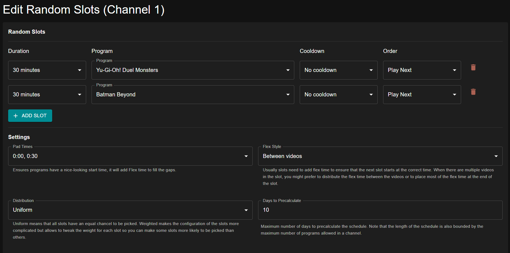

# Slots Editor

Slots Editor allows you to schedule programming in "slots". This tool is powerful and flexible and allows building various schedule types.

To use Slots Editor for your channel programming, select "TOOLS", then "Slots Editor".

## Slot Configuration

Each slot is configured with a few parameters.

When creating a programming slot, you choose between "Fixed" and "Dynamic" length.

* **Fixed** length slots run for an absolute duration (e.g. 30 mins)
* **Dynamic** length slots run for an absolute _count_ of programs (e.g. 3 episodes)

The **Cooldown** parameter controls a frequency cooldown; it is used when using "random" mode scheduling, which picks slots at random during schedule generation.

Some programming types also allow configuration of the **order** in which their constituents are scheduled. This controls the playback order; for example, if using "Next" ordering for a TV Show, episodes will be iterated over in episode order during scheduling.

## Scheduling Configuration

### Slot Choice

The options for how slots are chosen during schedule generation is part of what makes Slot Editor quite powerful. There are two main ways the scheduler can choose slots during schedule generation: **random** and **sequential**.

* **Random** choice chooses slots randomly. This slot choice has two subtypes: uniform and weighted.
    * **Uniform** random slot choice assigns equal weight to all slots. As scheduling progresses, each slot has an equal chance of being chosen for playback
    * **Weighted** slot choice allows you to modify the weights of each slot relative to one another
* **Sequential** (or **None**) chooses slots in the _order they are defined in the editor itself_. This allows for creation of finely tuned sequences of programming, airing in a particular order

### Schedule Options

#### Pad Times

Padding slots ensures that slots will always finish on a set of particular end times (e.g. :00 and :30). To achieve this, the scheduler will add ["flex" time](/configure/library/filler/#filler) to round each slot to the selected time pad.

#### Pad Style

Configure how "pad times" is applied. 

* **Pad Slot**: Align slot start times to the specified pad time.
* **Pad Episode**: Align episode start times (within a slot) to the specified pad time. NOTE: Depending on slot length and the chosen pad time, this could potentially create a lot of flex.

#### Flex Style

Determines how flex is added to a slot to fill in leftover time, either due to being a "fixed" duration slot or due to a pad times setting.

* **Between**: Flex time is added between videos within a slot, if there are multiple
* **End**: Flex time is added at the end of the slot

#### Days to Precalculate

Currently, Tunarr can only statically precalculate a schedule. This option determines how far into the future the schedule will be calculated before saving the lineup for playback.

## Presets

The Slot Editor also comes with some preset configurations based on the content of the channel.

### Cyclic Shuffle

This is an implementation of the original "cyclic shuffle" dizqueTV programming tool. By default, this preset schedules 1 block per program group, with a dynamic duration of 1 program per block. 

## Example

In this example, we want "30 Rock and "Arrested Development" to air in 30 minute blocks. We have Pad Times set to 00:00 and 00:30, so the episodes will always try to air right at those times by using [Flex](/configure/channels/flex) to fill the empty time. 

Below is a generated schedule with this configuration. A few things to note:

* 

<figure markdown="span">
  
  <figcaption>Example generated schedule</figcaption>
</figure>

In this example, one of our shows has far more episodes than the other but by default the episode Distribution is Uniform so the shows will be ordered with equal priority. If we instead wanted "Yu-Gi-Oh! Duel Monsters" to air 70% of the time, and "Batman Beyond" to air 30% of the time, we would set Distribution to Weighted and adjust the sliders. 

See below for an example of our schedule now that "Yu-Gi-Oh! Duel Monsters" is Weighted to air 70% of the time. 

