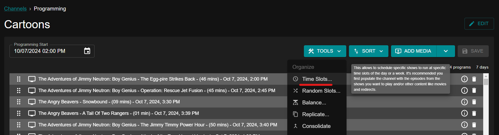
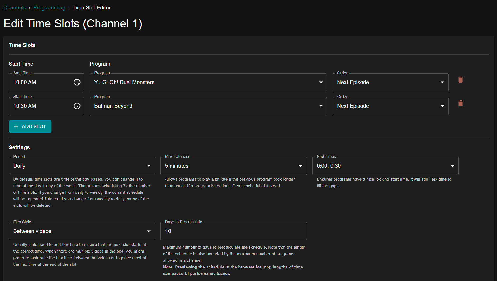
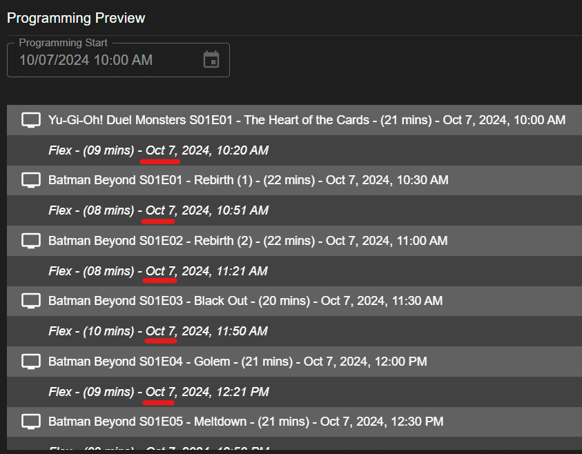
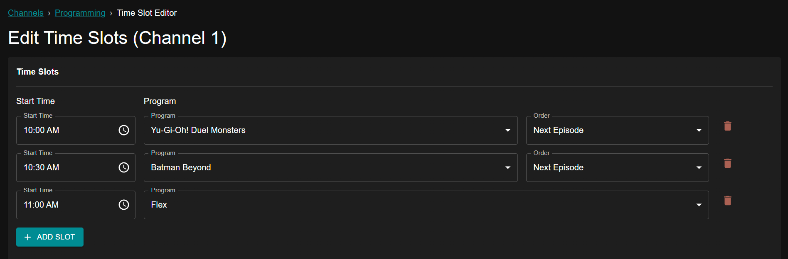
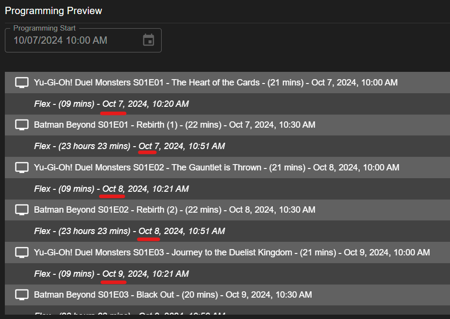

# Time Slots

Time Slots allow you to schedule specific shows to run at specific time slots each day or week. 

To schedule Time Slots for your channel programming, select "TOOLS", then "Time Slots".

In this example, we want "Yu-Gi-Oh! Duel Monsters" to always air at 10am each day, followed by "Batman Beyond" at 10:30am each day. We also want [Flex](/configure/channels/flex) to fill the time in-between episodes using the Pad Times option, so that episodes always air right at 10am and 10:30am. We have allowed 5 minutes of lateness, so if an episode runs over the 30 minute time slot by 5 minutes or less, the next shows episode will still play no later than 10:35am.

See below for an example of our current schedule. Please note that as we have only selected two time slots for the entire day, "Batman Beyond" being our last scheduled show will continue airing until the following day at 10am when the next scheduled episode of "Yu-Gi-Oh! Duel Monsters" is set to air.

If we instead wanted to air these two episodes, then have the channel play Flex content until the next episode of "Yu-Gi-Oh! Duel Monsters" the following day at 10am, we would simply add Flex after "Batman Beyond".

See below for an example of our schedule now that we have Flex after our two episodes air. Now it will alternate Show 1 Day 1, Show 2 Day 1, Show 1 Day 2, Show 2 Day 2, etc. 

