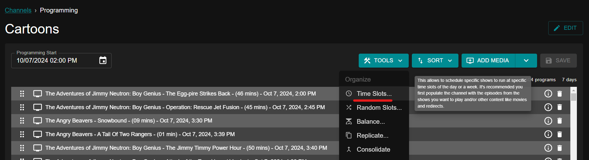
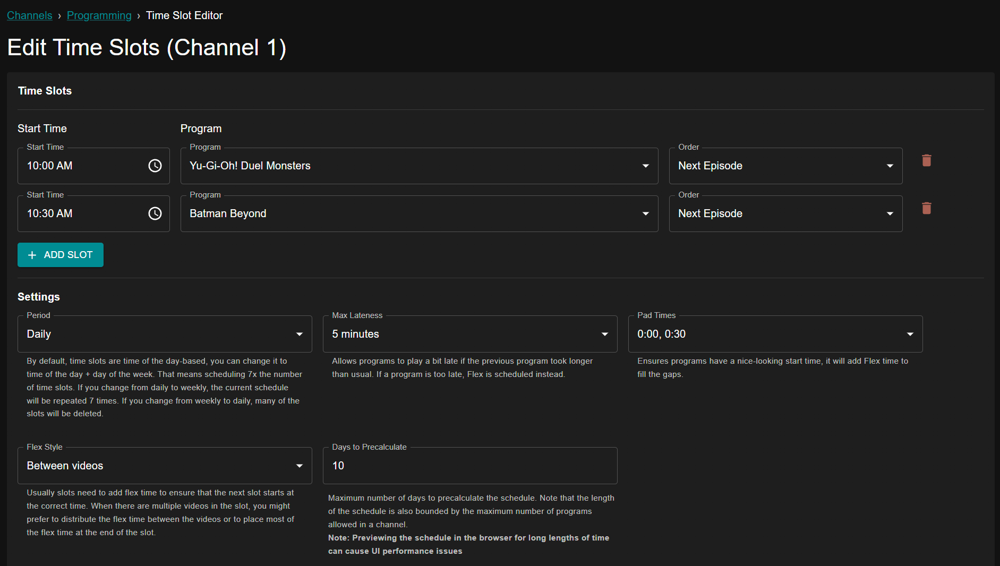
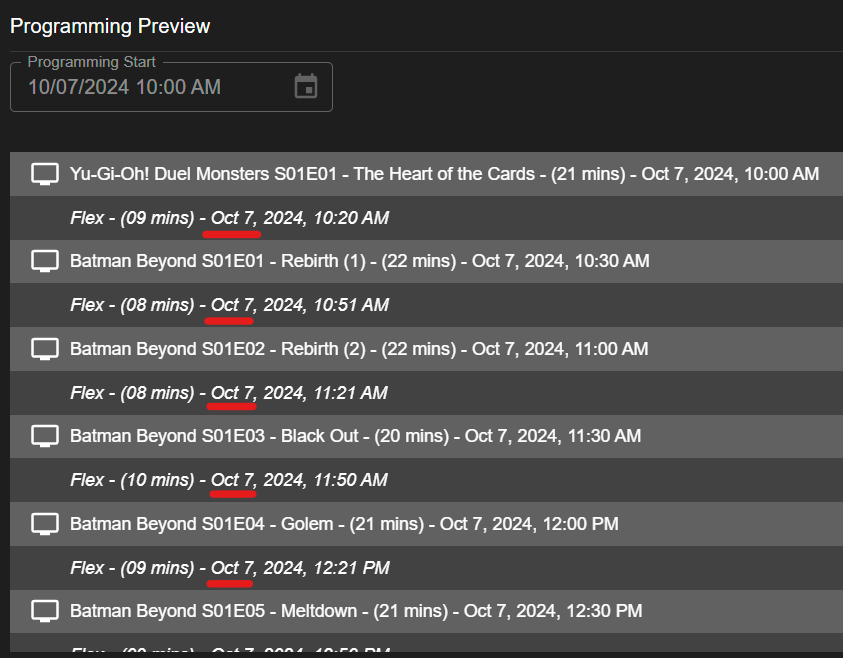
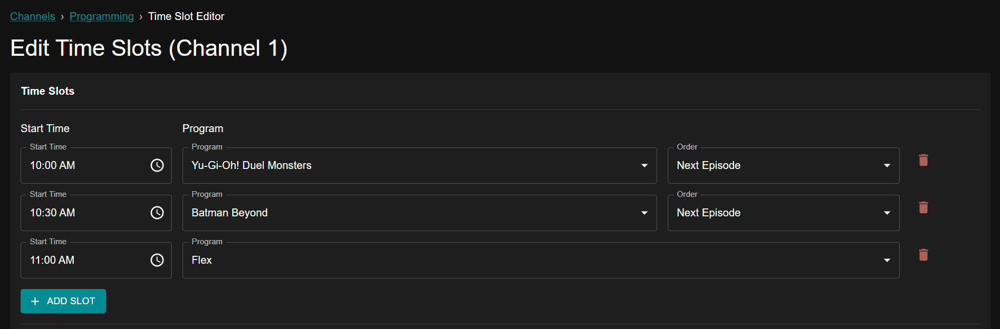
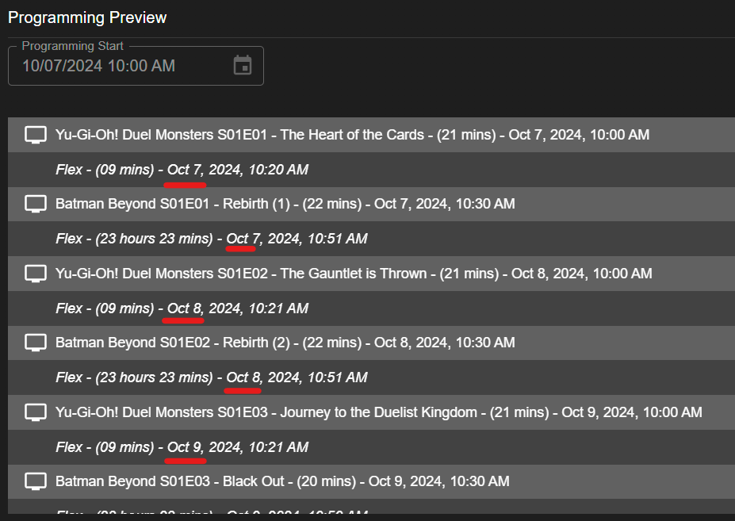

# Time Slots

Time Slots allow you to schedule specific shows to run at specific time slots each day or week. 

To schedule Time Slots for your channel programming, select "TOOLS", then "Time Slots".

In this example, we want "Yu-Gi-Oh! Duel Monsters" to always air at 10am each day, followed by "Batman Beyond" at 10:30am each day. We also want [Flex](/configure/channels/flex) to fill the time in-between episodes using the Pad Times option, so that episodes always air right at 10am and 10:30am. We have allowed 5 minutes of lateness, so if an episode runs over the 30 minute time slot by 5 minutes or less, the next shows episode will still play no later than 10:35am.

See below for an example of our current schedule. Please note that as we have only selected two time slots for the entire day, "Batman Beyond" being our last scheduled show will continue airing until the following day at 10am when the next scheduled episode of "Yu-Gi-Oh! Duel Monsters" is set to air.

If we instead wanted to air these two episodes, then have the channel play Flex content until the next episode of "Yu-Gi-Oh! Duel Monsters" the following day at 10am, we would simply add Flex after "Batman Beyond".

See below for an example of our schedule now that we have Flex after our two episodes air. Now it will alternate Show 1 Day 1, Show 2 Day 1, Show 1 Day 2, Show 2 Day 2, etc.

## Padding

Padding controls how Tunarr handles the gap between when a program finishes and when the next scheduled slot is due to start. When a program ends before its slot's start time, Tunarr fills the gap with [Flex](/configure/channels/flex) content (or silence if no filler is configured) so that the next program begins at exactly the scheduled time.

### Global Pad Time

The **Pad Times** setting applies a uniform pad duration to all slots in the schedule. This is the primary way to enforce "hard" start times: if an episode finishes 8 minutes before the next slot, those 8 minutes are filled with flex content.

### Per-Slot Padding

Individual slots can override the global pad time with their own value. This is useful when different slots have different tolerance requirements — for example, a morning block that needs tight padding while an evening block can be more flexible.

To set per-slot padding, open the slot's options in the Time Slot editor. When a slot has its own pad time set, it takes precedence over the global **Pad Times** value for that slot only. Slots without a per-slot override continue to use the global value.

### Max Lateness

The **Max Lateness** setting is a companion to padding. It defines how far a program is allowed to run past the slot's scheduled start time before the slot is skipped and the next one begins. For example, with a max lateness of 5 minutes, an episode that would end 4 minutes into the next slot will still be allowed to play in full; one that would end 6 minutes into the next slot will be cut off at the slot boundary.