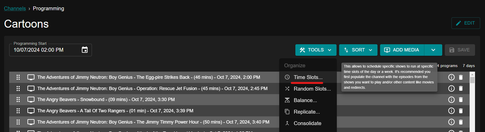
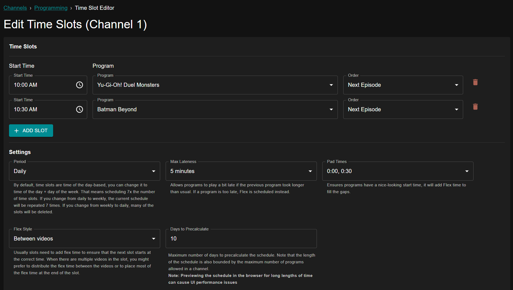
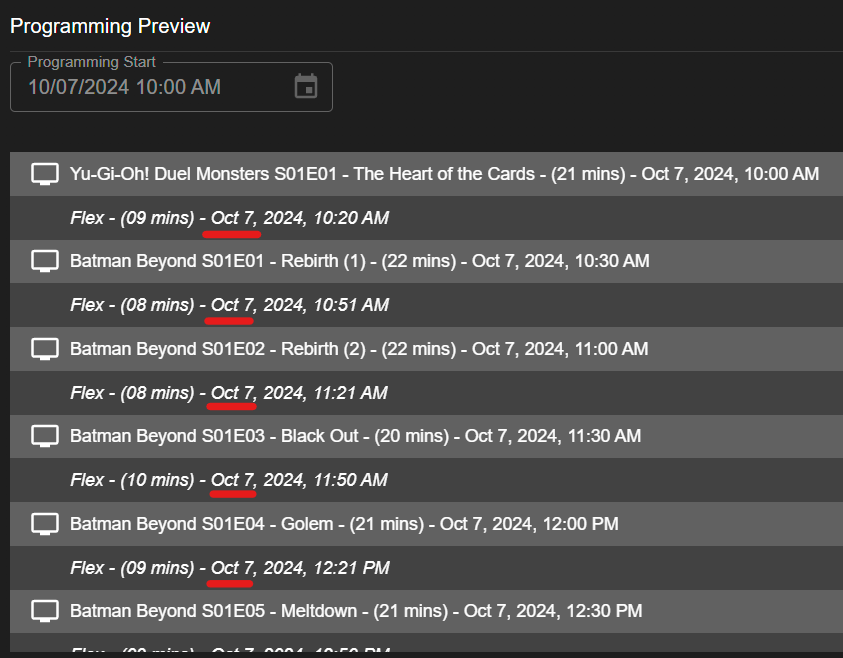
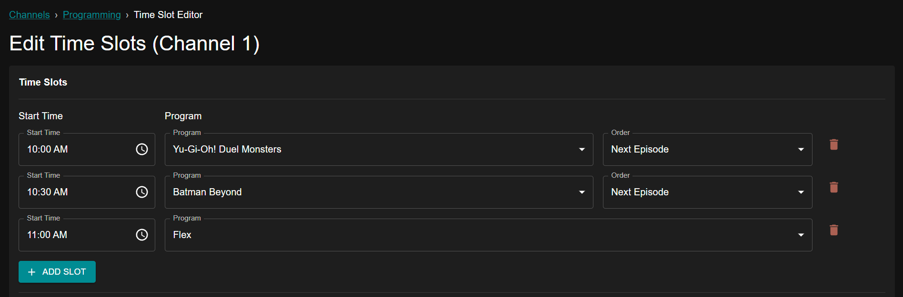
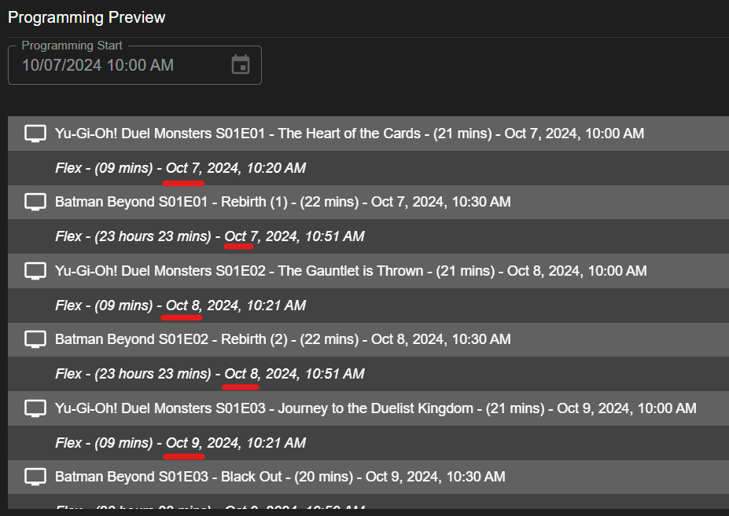

# Time Slots

Time Slots allow you to schedule specific shows to run at specific time slots each day or week. 

To schedule Time Slots for your channel programming, select "TOOLS", then "Time Slots".

In this example, we want "Yu-Gi-Oh! Duel Monsters" to always air at 10am each day, followed by "Batman Beyond" at 10:30am each day. We also want [Flex](/configure/channels/flex) to fill the time in-between episodes using the Pad Times option, so that episodes always air right at 10am and 10:30am. We have allowed 5 minutes of lateness, so if an episode runs over the 30 minute time slot by 5 minutes or less, the next shows episode will still play no later than 10:35am.

See below for an example of our current schedule. Please note that as we have only selected two time slots for the entire day, "Batman Beyond" being our last scheduled show will continue airing until the following day at 10am when the next scheduled episode of "Yu-Gi-Oh! Duel Monsters" is set to air.

If we instead wanted to air these two episodes, then have the channel play Flex content until the next episode of "Yu-Gi-Oh! Duel Monsters" the following day at 10am, we would simply add Flex after "Batman Beyond".

See below for an example of our schedule now that we have Flex after our two episodes air. Now it will alternate Show 1 Day 1, Show 2 Day 1, Show 1 Day 2, Show 2 Day 2, etc.

## Slot Requirements

Tunarr checks these rules when you save or preview a schedule, and rejects a schedule that breaks one with HTTP 400.

- A schedule needs at least one slot.
- Each slot's start time is a whole number of milliseconds within the period.
- Pad times and the number of days to schedule are greater than zero.
- Every filler list, show, smart collection, and channel a slot references must exist.

## Empty or Deleted Custom Shows

A custom show with no programs cannot fill a time slot.

- The editor does not offer empty custom shows for new slots.
- A saved slot whose custom show later becomes empty, or is deleted, keeps its selection and shows a warning. Choose another show or remove the slot. Saving is blocked until every slot is fixed.
- The API rejects a new schedule or preview that references an empty or unknown custom show with HTTP 400, and leaves the channel's lineup unchanged.
- When Tunarr regenerates an already saved schedule, the empty slot's time is filled with [Flex](/configure/channels/flex).
- Programs with no duration are skipped, because they cannot advance the schedule.

## Slot Linking

By default, each time slot maintains its own episode cursor. If the same show appears in multiple time slots (e.g. a morning and evening airing), each slot independently starts at episode 1 and advances separately.

To make multiple time slots share a single episode iterator, use [Slot Linking](slot-linking.md). In **continue** mode, the slots advance together sequentially. In **rerun** mode, every linked slot plays the same episode before the group moves on -- useful for simulating same-day reruns at different times.

## Padding

Padding controls how Tunarr handles the gap between when a program finishes and when the next scheduled slot is due to start. When a program ends before its slot's start time, Tunarr fills the gap with [Flex](/configure/channels/flex) content (or silence if no filler is configured) so that the next program begins at exactly the scheduled time.

### Global Pad Time

The **Pad Times** setting applies a uniform pad duration to all slots in the schedule. This is the primary way to enforce "hard" start times: if an episode finishes 8 minutes before the next slot, those 8 minutes are filled with flex content.

### Per-Slot Padding

Individual slots can override the global pad time with their own value. This is useful when different slots have different tolerance requirements — for example, a morning block that needs tight padding while an evening block can be more flexible.

To set per-slot padding, open the slot's options in the Time Slot editor. When a slot has its own pad time set, it takes precedence over the global **Pad Times** value for that slot only. Slots without a per-slot override continue to use the global value.

### Max Lateness

The **Max Lateness** setting is a companion to padding. It defines how late a slot may start when the program before it runs long. Tunarr never cuts a program off, so a program that runs past the next slot's start time always plays in full. When it ends, Tunarr checks how late the slot it has run into would start:

- If the slot would start within its max lateness, it starts late.
- Otherwise Tunarr skips that slot, fills the rest of its time with [Flex](/configure/channels/flex), and resumes at the next slot's start time.

For example, with a max lateness of 5 minutes, an episode that ends 4 minutes into the next slot is followed by that slot's program, 4 minutes late. An episode that ends 6 minutes into the next slot is followed by Flex until the slot after it begins.

A slot can override the global max lateness in its options in the Time Slot editor. The override applies when Tunarr arrives late at *that* slot, so set it on the slot that would be delayed or skipped, not on the slot that runs long.

#### Example: A Long Program in a Short Slot

An anime slot airs 22-minute episodes in a 30-minute slot at 6:00pm, and the season ends with a 100-minute movie. The global pad time is 5 minutes. On the movie's day:

1. The movie plays in full, from 6:00pm to 7:40pm.
2. Any slot that starts and ends while the movie is playing, like a 6:30pm slot, is skipped for that day.
3. The 7:30pm slot is 10 minutes late when the movie ends. With the global max lateness at 5 minutes, Tunarr skips it and plays Flex until the next slot. If the 7:30pm slot has its own max lateness of 15 minutes, its program starts at 7:40pm instead.

The global max lateness can stay small, because the long program never needs lateness to finish. Pad time is applied before lateness, so with a 30-minute global pad time Tunarr would first fill 7:40pm to 8:00pm with Flex and the 7:30pm slot would never be considered.

### Max Overflow

The **Max Overflow** setting controls how many programs a slot packs in. A slot always plays at least one program. After that, Tunarr keeps adding programs from the slot while they fit:

- **Do not allow** adds a program only if it ends by the next slot's start time.
- A duration such as **15 minutes** lets an added program end up to that long after the next slot's start time.
- **One extra item** keeps adding programs until the slot is full, so the last one may run past the next slot's start time by any amount.

Max overflow and max lateness work together. Overflow decides how far a slot may run past its end, and the next slot's max lateness decides whether that slot then starts late or is skipped. Like max lateness, overflow can be set globally or overridden per slot.