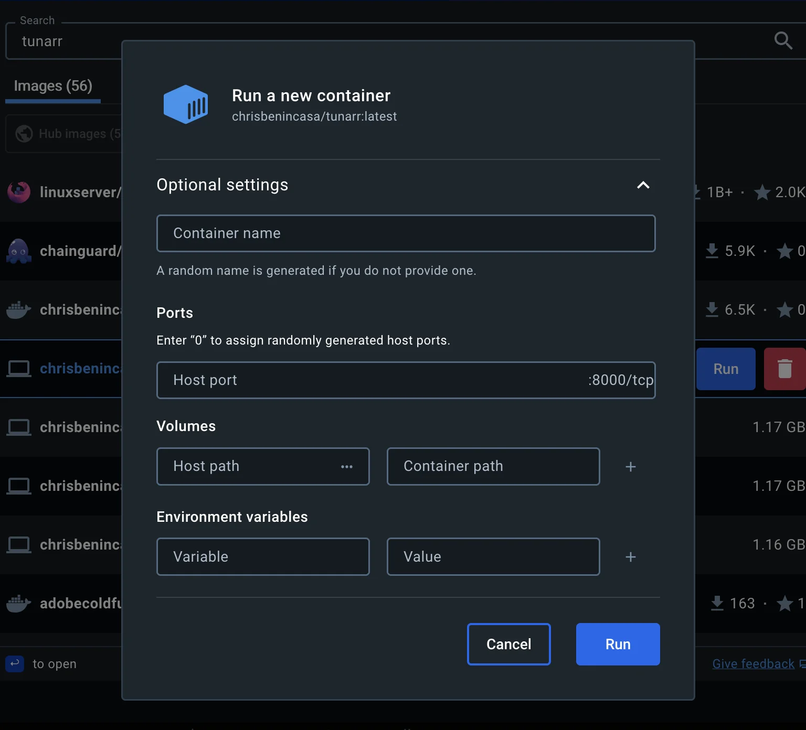

# Run

This page describes how to get Tunarr running with various methods and installation methods.

## Docker

```
docker run \
    -v "$(pwd)"/tunarr:/config/tunarr \
    -v "$(pwd)"/.dizquetv:/.dizquetv \
    -e "TZ=America/New_York" \
    -p 8000:8000 \
    chrisbenincasa/tunarr
```

Or if using `docker compose`...

```yaml title="docker-compose.yml"
version: '3.8'
services:
  tunarr:
    image: chrisbenincasa/tunarr:latest
    container_name: tunarr
    ports:
      - ${TUNARR_SERVER_PORT:-8000}:8000
    # Uncomment if using the Nvidia container
    # runtime: nvidia
    environment:
      - LOG_LEVEL=${TUNARR_LOG_LEVEL:-INFO}
      # Replace this with your timezone to ensure accurate guide
      # data and scheduling.
      - TZ=America/New_York
      # Uncomment if you'd like to adjust default config path
      # - TUNARR_DATABASE_PATH=/your/path/tunarr
    volumes:
      # Choose a path on your host to map to /config/tunarr. This ensures
      # that restarting the container will not delete your settings or DB.
      - /path/to/tunarr/data:/config/tunarr
    # The host path is relative to the location of the compose file
    # This can also use an absolute path.
    #
    # Uncomment if migrating from dizquetv. Chnage the host path
    # to the location of your dizquetv "database"
    # - ./.dizquetv:/.dizquetv
```

### Docker Desktop

If using Docker Desktop, before running the Tunarr container, you have to use the GUI to configure some of the options mentioned above. This can be done by clicking on the "Optional settings" button. This will show the UI below, where, at the very least, you should configure a volume bind mount (so that your configurations don't get deleted if the container restarts / Tunarr is upgraded). Set the "Container path" to `/config/tunarr` and the Host path to the path on your system where you want to save Tunarr data. Additionally, expose the port of your choice to access Tunarr, by setting "Host port" to the port of your choice.



## Configuration

Tunarr has various command line / environment variables for configuration. These are listed below.

| Environment Variable   | Command Line Flag | Default value | Description                                                                                                                                        |
| ---------------------- | ----------------- | ------------- | -------------------------------------------------------------------------------------------------------------------------------------------------- |
| `TUNARR_DATABASE_PATH` | `--database`      | `''`          | Sets the path where Tunarr will write its data to. **NOTE** Do not set this if using docker; use a bind mount pointed to `/config/tunarr` instead. |
| `TUNARR_SERVER_PORT`   | `--port`/`p`      | 8000          | Sets the port that the Tunarr server will listen on. **NOTE** When using Docker prefer using a port mapping than setting this. |
| `TUNARR_SERVER_ADMIN_MODE` | `--admin` | FALSE | Starts Tunarr in [admin mode](/configure/system/security/#admin-mode) | 
| `TUNARR_SERVER_PRINT_ROUTES` | `--print_routes` | FALSE | Prints all of Tunarrs server routes at startup |
| `TUNARR_SERVER_TRUST_PROXY` | `--trust_proxy` | FALSE | Enables [trust proxy](/configure/system/security/#trust-proxy) for using Tunarr behind a reverse proxy |
| `TUNARR_BIND_ADDR` | N/A | `0.0.0.0` | Sets the interface that Tunarr will attempt to bind its server to. **NOTE** Change at your own risk! By default, Tunarr listens on all network interfaces | 
| `TUNARR_USE_WORKER_POOL` | N/A | FALSE | Set to true to enable experimental support for Tunarr's worker threads | 
| `TUNARR_WORKER_POOL_SIZE` | N/A | `cpus().length` | Control the number of worker threads Tunarr creates in its pool. It's recommended to use no more than the number of CPUs on the host system | 
| `TUNARR_DEBUG_REDUCE_SEARCH_INDEXING_MEMORY` | N/A | TRUE | By default, Meilisearch will attempt to [reduce search indexing memory usage](https://www.meilisearch.com/docs/learn/self_hosted/configure_meilisearch_at_launch#reduce-indexing-memory-usage), which can have an [impact on file storage](https://github.com/chrisbenincasa/tunarr/issues/1558). Setting this to `false` will skip that. Not available for Windows users. |

## Hardware Transcoding

### Nvidia

There are many ways to enable usage of an Nvidia GPU in a Docker container. The latest, and arguably simplest, method is to install and configure the [Nvidia Container Toolkit](https://docs.nvidia.com/datacenter/cloud-native/container-toolkit/latest/install-guide.html).

#### Docker CLI example with Nvidia

```
docker run \
    --runtime nvidia
    -v "$(pwd)"/tunarr:/config/tunarr \
    -e "TZ=America/New_York" \
    -p 8000:8000 \
    chrisbenincasa/tunarr
```

#### Docker Compose example with Nvidia

```yaml title="docker-compose-nvidia.yml"
version: '3.8'
services:
  tunarr:
    image: chrisbenincasa/tunarr:latest
    container_name: tunarr
    ports:
      - ${TUNARR_SERVER_PORT:-8000}:8000
    runtime: nvidia
    environment:
      - LOG_LEVEL=${TUNARR_LOG_LEVEL:-INFO}
      - NVIDIA_VISIBLE_DEVICES=all
      - TZ=America/New_York
    # Uncomment if you'd like to adjust default config path
    # - TUNARR_DATABASE_PATH=/your/path/tunarr
    volumes:
      # Choose a path on your host to map to /config/tunarr. This ensures
      # that restarting the container will not delete your settings or DB.
      - /path/to/tunarr/data:/config/tunarr
```

### QSV (Intel) / VA-API (Video Acceleration API)

For QSV compatability in Docker, you must mount `/dev/dri` the container:

#### Docker CLI Example

```
docker run \
  -v "$(pwd)"/tunarr:/config/tunarr \
  --device /dev/dri:/dev/dri \
  -e "TZ=America/New_York" \
  -p 8000:8000 \
  chrisbenincasa/tunarr:latest
```

#### Docker Compose Example

```yaml title="docker-compose-vaapi.yml"
version: '3.8'
services:
  tunarr:
    image: chrisbenincasa/tunarr:latest
    container_name: tunarr
    ports:
      - ${TUNARR_SERVER_PORT:-8000}:8000
    environment:
      - LOG_LEVEL=${TUNARR_LOG_LEVEL:-INFO}
      - TZ=America/New_York
    # Pass all render devices to container
    devices:
      - /dev/dri:/dev/dri
    volumes:
      # Choose a path on your host to map to /config/tunarr. This ensures
      # that restarting the container will not delete your settings or DB.
      - /path/to/tunarr/data:/config/tunarr
```

## Standalone binaries

### \*nix Setup

After downloading the binary from Github, you must re-add executable permissions to the file. In Linux or macOS, this can be done by running

```
chmod +x ./tunarr-linux-64
```

Replace `tunarr-linux-64` with the path to the Tunarr binary you downloaded.

### Run as a service

It's recommended to run Tunarr as a service / background task. Below are examples depending on your host OS.

#### systemd (Linux)

Below is a sample systemd service definition that can be used as a starting point to running Tunarr via systemd on Linux.

Setup:

1. In terminal, execute `sudo mkdir /opt/tunarr/`
2. Execute `sudo mkdir /opt/tunarr/streams`
3. Execute a `sudo mv tunarr-linux-x64 /opt/tunarr/tunarr-linux-x64` (replace the first path with the path you downloaded Tunarr too, which will include the version)
4. Execute `sudo nano /etc/systemd/tunarr.service`
5. Copy and paste the service definition below:

```systemd
[Unit]
Description=Tunarr
Wants=network-online.target
After=network-online.target

[Service]
Type=simple
WorkingDirectory=/opt/tunarr
ExecStart=bash /opt/tunarr/tunarr-linux-x64
ExecReload=pkill tunarr-linux-x64
ExecStop=pkill tunarr-linux-x64
KillMode=process
Restart=always
RestartSec=15

# Replace these values!
User=YOUR_USER
Group=YOUR_GROUP

StandardOutput=journal
StandardError=journal

[Install]
WantedBy=multi-user.target
```

6. Execute a `ctrl+o`, on the keyboard. When prompted to save the buffer, press Enter to save and exit.
7. Execute `sudo systemctl daemon-reload`
8. In terminal, execute `sudo systemctl enable tunarr.service`
9. Execute `sudo systemctl start tunarr`

#### launchd (macOS)

Save the following launchd configuration to `~/Library/LaunchAgents/tunarr.xml`. Replace `/Path/to/tunarr` with the directory path in which you installed Tunarr. We recommend moving this to somewhere stable (i.e. out of your Downloads folder) like `$HOME/.local/bin`

```xml
<?xml version=“1.0” encoding=“UTF-8”?>
<!DOCTYPE plist PUBLIC “-//Apple//DTD PLIST 1.0//EN” “http://www.apple.com/DTDs/PropertyList-1.0.dtd”>
<plist version=“1.0”>
<dict>
    <key>Label</key>
    <string>com.tunarr.server.app</string>
    <key>Program</key>
    <string>/Path/to/tunarr/tunarr</string>
    <key>WorkingDirectory</key>
    <string>/Path/to/tunarr</string>
    <key>RunAtLoad</key>
    <true/>
    <key>KeepAlive</key>
    <true/>
    <key>StandardErrorPath</key>
    <string>/Path/to/tunarr/error.log</string>
    <key>StandardOutPath</key>
    <string>/Path/to/tunarr/output.log</string>
    <key>UserName</key>
    <string>USER_TO_RUN_TUNARR_AS</string>
    <key>HOME</key>
    <string>/Path/to/home</string>
</dict>
</plist>
```

#### NSSM (Windows)

[NSSM](https://nssm.cc/) is the recommended way to run Tunarr as a background task in Windows. It is recommended to configure NSSM to run Tunarr as the currently logged in user.

1. [Download NSSM](https://nssm.cc/ci/nssm-2.24-101-g897c7ad.zip) from its website. The latest version is recommended because it is more compatible with the latest versions of Windows.
2. Once unzipped, you will obtain the `nssm.exe` file (inside `win64` folder). Create a folder called `nssm` and place the `nssm.exe` file inside it. Then move this folder to the `Program Files` folder. The final path for NSSM will be: `C:\Program Files\nssm\nssm.exe`
3. Insert the NSSM file into the Windows environment variables. If you already know how to do this, skip directly to step 6.
4. Open the start menu and type “Path.” At this point, “edit system environment variables” will appear in the search. Click on it and a new window will open with the words “environment variables...” at the bottom. Click on it.
5. Another window will open and in the upper section we will need to select “Path” and then click on “Edit.” In this last window that opens, we will click on “New” and enter this path: `C:\Program Files\nssm`. Now we can click on OK and close all the other windows that were previously open by clicking on OK again.
6. Open "Command Prompt" as administrator, type `nssm install`, and press enter. The nssm configuration window will open. What we are interested in for now is filling in some fields in the ‘Application’ and “Details” tabs.
7. The first field to fill in is the service name at the bottom, in our example the name entered will simply be “Tunarr”.
8. Assuming you've placed our `tunarr.exe` in the following path: `C:\Program files\tunarr\tunar.exe`, in the “Application” tab, simply copy and paste the entire path, including .exe, into the “Path” field. If you have Tunarr in a different location, use that path instead.
9. In the “startup folder” field, enter only the path to the folder, so in our example it will be `C:\Program files\tunarr` (without quotation marks). The “arguments” field can be left blank, but if you need a different port at this stage that you have not yet changed within Tunarr, you can add `--port 8001` to change the port to 8001, or one of your choice (useful when using a program, such as dizqueTV, that has already occupied port 8000).
10. Now go to the “Details” tab. Everything here is less important. Just enter “Tunarr” in the “Display name” field and something of your choice in the ‘Description’ field. Leave the startup type set to “Automatic.”
11. Click on “Install service” and Tunarr will finally be installed as a service

##### Updating Tunarr within NSSM

From now on, to update tunarr, we will first have to stop the service. 
1. Click on the start menu and search for “services”. Click on the result.
2. On the next screen with the list of all services, right-click on Tunarr and click on “stop.” 
3. Replace the .exe file with the updated executable, return to the services screen, right-click on Tunarr, and select “start”

##### Converting Tunarr to an NSSM service

If you are converting from a previously used Tunarr, please note that the main Tunarr folder will now be moved to another location, so the new Tunarr that starts will actually behave as if it were a new installation. To restore the entire configuration, you will need to copy the contents of the Tunarr folder in the path usually used by the program `%appdata%\ tunarr` and paste it into the following location: `C:\Windows\System32\config\systemprofile\AppData\Roaming\tunarr`
This will be the new location for the database, channels, and everything else (obviously, this must be done after stopping the tunarr service and then restarting it as explained above).
