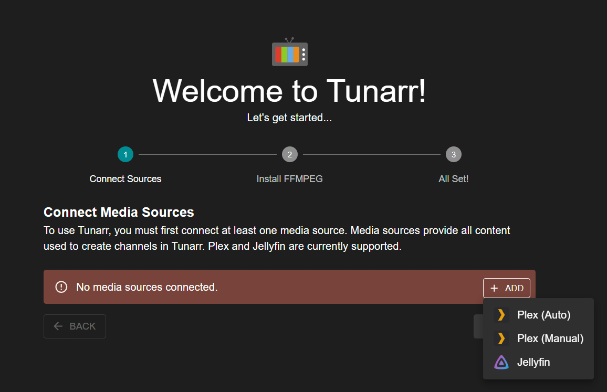
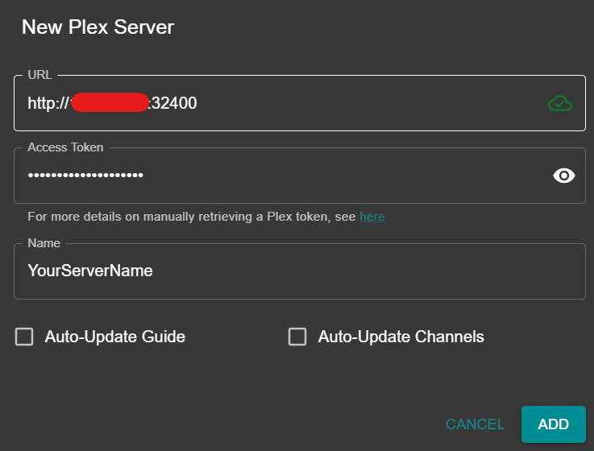
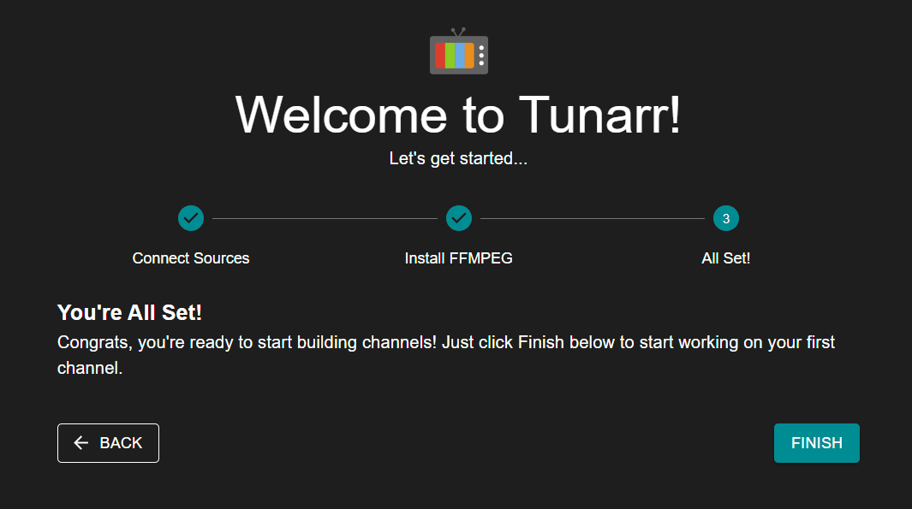

# Setup

## Initial Setup

Upon first launching Tunarr, you will see the Welcome page with a few required setup steps.



### Media Sources

Currently, Tunarr supports Plex, Jellyfin, and Emby as media sources. In order to add programming to your channels, you must connect at least one media source. Each media source acts as a metadata source for your programming, and optionally, the streaming source.

Click the "Add" button, followed by your source. For Plex, you can choose Auto to perform automatic web authentication. Alternatively, you can select Manual, input your URL (http://serverIP:32400) and [Access Token](https://support.plex.tv/articles/204059436-finding-an-authentication-token-x-plex-token/). Unless you have a specific reason for doing so, leave Auto-Update Guide and Auto-Update Channels unchecked. If communication with your server is successful, you should see a green checkmark cloud icon next to your server URL.



!!! info

    We plan on implementing other media source types, including [Emby](https://github.com/chrisbenincasa/tunarr/issues/25) and [Local Media](https://github.com/chrisbenincasa/tunarr/issues/26). Upvote and follow the issues you'd like to see us implement!

### FFMPEG

Tunarr also requires [FFmpeg](https://ffmpeg.org/). FFmpeg is used to normalize channel video / audio streams for seamless playback, interleave your "flex" content, and more. Tunarr defaults to looking for the FFmpeg executable at `/usr/bin/ffmpeg`. If no executable is found, you can change the path in the FFmpeg settings page. The minimum known supported version of FFmpeg is 6.1. The recommended version is 7.1.1.

Please note that FFmpeg is provided in Tunarr Docker images, so Docker users should not need to make any adjustments to this page.


Click "FINISH" and you will be brought to the new channel page to [create your first channel](/configure/channels/properties).



```

```
