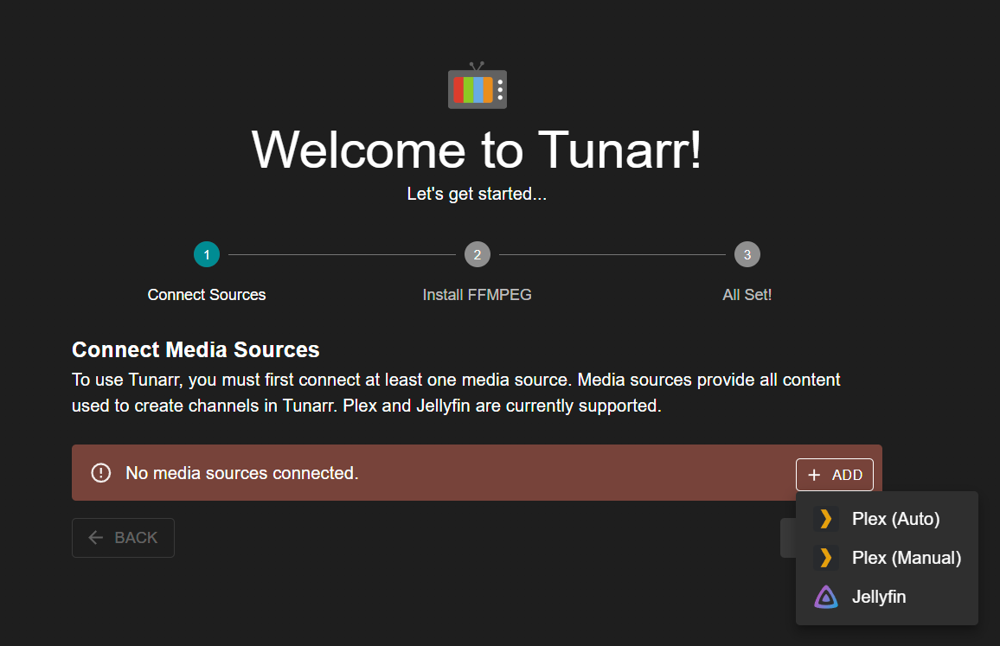
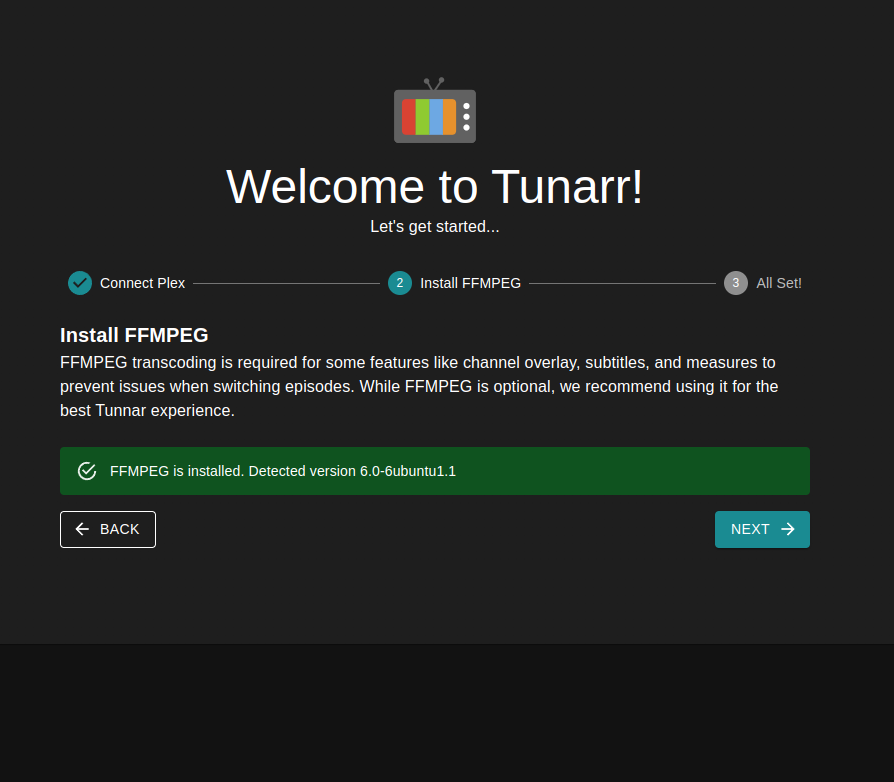
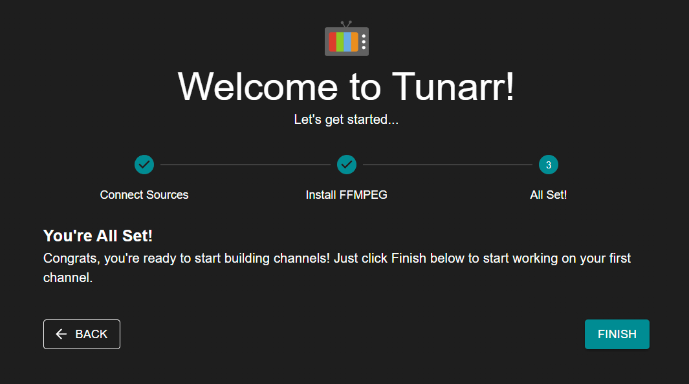

# Setup

## Initial Setup

Upon first launching Tunarr, you will see the Welcome page with a few required setup steps. By default, Tunarr will be available at http://localhost:8000.



### Media Sources

Currently, Tunarr supports Plex, Jellyfin, Emby, and local media as media sources. In order to add programming to your channels, you must connect at least one media source. Each media source acts as a metadata source for your programming, and optionally, the streaming source.

See the [media sources](../configure/media_sources) page for more info on configuring media sources!

### FFmpeg

!!! info
    Please note that FFmpeg is provided in Tunarr Docker images, so Docker users should not need to make any adjustments to this page.

Tunarr also requires [FFmpeg](https://ffmpeg.org/). FFmpeg is used to normalize channel video / audio streams for seamless playback, interleave your "flex" content, and more. Tunarr defaults to looking for the FFmpeg executable at `/usr/bin/ffmpeg`. If no executable is found, you can change the path in the FFmpeg settings page. The minimum known supported version of FFmpeg is 6.1. The recommended version is 7.1.1. We recommend [this build of FFmpeg](https://github.com/ErsatzTV/ErsatzTV-ffmpeg/releases/tag/7.1.1) as it matches what is shipped in Tunarr docker containers.



Click "FINISH" and you will be brought to the new channel page to [create your first channel](/configure/channels/properties).



```

```
